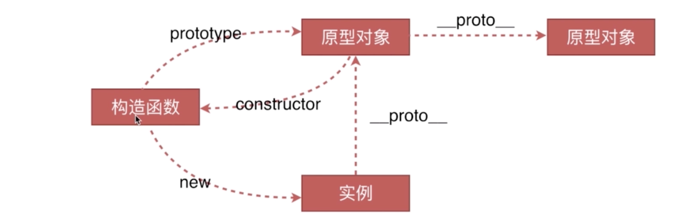

---

hideFooter: true

---
# js--面试总结 #

::: tip 契子
- https://github.com/huyaocode/webKnowledge --- 大神面经，值得参考
- 
:::

## &01.如何解决异步回调地域 ##

## &02.说一下类的创建与继承 ##
答：在js中创建一个函数就是创建一个对象，一个对象就是一个类。每一个创建的函数都有一个原型对象，通过原型对象我们可以实现JS类中的继承。
- 创建对象有几种方法
    1.构造函数模式
    2.new操作符 + Object创建对象
    ```bash
        var person = new Object();
        person.name = "lisi";
        person.age = 21;
        person.family = ["lida","lier","wangwu"];
        person.say = function(){
            alert(this.name);
        }
    ```
    3.工厂模式--instanceof无法判断它是谁的实例，只能判断它是对象
    ```bash
       function createPerson(name,age,family) {
        var o = new Object();
        o.name = name;
        o.age = age;
        o.family = family;
        o.say = function(){
            alert(this.name);
        }
        return o;
    }

    var person1 =  createPerson("lisi",21,["lida","lier","wangwu"]);   //instanceof无法判断它是谁的实例，只能判断他是对象，构造函数都可以判断出
    var person2 =  createPerson("wangwu",18,["lida","lier","lisi"]);
    console.log(person1 instanceof Object);                           //true
    ```
    4.构造函数模式
    ```bash
       function Person(name,age,family) {
            this.name = name;
            this.age = age;
            this.family = family;
            this.say = function(){
                alert(this.name);
            }
        }
        var person1 = new Person("lisi",21,["lida","lier","wangwu"]);
        var person2 = new Person("lisi",21,["lida","lier","lisi"]);
        console.log(person1 instanceof Object); //true
        console.log(person1 instanceof Person); //true
        console.log(person2 instanceof Object); //true
        console.log(person2 instanceof Person); //true
        console.log(person1.constructor);      //constructor 属性返回对创建此对象的数组、函数的引用
    ```
    5.原型模式
    6.混合模式
- 原型、构造函数、实例、原型链

    * * prototpye原型：指的是一个对象，实例“继承”那个对象的属性。在原型上定义的属性，通过“继承”，实例也拥有了这个属性。“继承”行为这个操作是在new操作符中进行的。
    * * __proto__：实例通过__proto__访问到原型
- instanceof的原理

instanceof运算符用于判断一个对象的原型链是否存在一个构造函数的prototype属性。

判断实例对象的属性和构造函数的属性是否是同一地址。实例对象.__proto === 构造函数.prototype ,只要是同一原型链的构造函数实例，instanceof都会被看作是true

判断原型对象：实例.__proto__.constructor === 构造函数

- new运算符-背后的原理

    1、创建一个新对象

    2、将构造函数的prototype赋值给新对象的__proto__;

    3、构造函数中的this指向新对象，并调用构造函数

    4、如果构造函数无返回值，或者不是引用类型，返回新对象，否则为构造函数的返回值

- new Object和Object.create的不同

    1、new Object是用构造函数来创建对象，添加的属性是在自身实例下；Object.create es6创建对象的另外一种方法，可以理解为继承一个对象，添加的对象是在原型上。
    ```bash
       // new Object() 方式创建
        var a = {  rep : 'apple' }
        var b = new Object(a)
        console.log(b) // {rep: "apple"}
        console.log(b.__proto__) // {}
        console.log(b.rep) // {rep: "apple"}

        // Object.create() 方式创建
        var a = { rep: 'apple' }
        var b = Object.create(a)
        console.log(b)  // {}
        console.log(b.__proto__) // {rep: "apple"}
        console.log(b.rep) // {rep: "apple"}
    ```
## &03.面向对象 ##
- 类与实例
    * 类的声明
    * 生成实例
- 类与继承
    * 如何形成继承

    1、构造函数继承
     ```bash
       //构造函数继承--实现部分继承
		function Parent() {
			this.name = "parent";
		}
		//构造函数继承，子类不会继承父类的prototype方法，只能继承构造函数的属性
		Parent.prototype.say = function() {
			console.log('hello');
		}
		function Child() {
			Parent.call(this);   //call改变this指向
			this.type = 'child';
		}
		let child1 = new Child;
		console.log(new Child);
    ```
    2.原型链继承
    ```bash
    //借助原型链实现继承
		//缺点一：新实例无法向构造函数传参
		//缺点二：所有的新实例都会共享父类实例的属性（原型上的属性是共享的，一个实例改变了，另一个也会一起改变）
		function Parent2() {
			this.name = "parent2";
		}
		function Child2() {
			this.type = "child2";
		}
		Child2.prototype = new Parent2;
		console.log(new Child2);
    ```
    3.组合式继承
    ```bash
        //组合方式继承--原型链+构造函数
        //弥补原型链和构造函数的缺点
		function Parent3() {
			this.name = 'parentt3';
		}
		function Child3() {
			Parent3.call(this);
			this.type = 'child3';
		}
		Child3.prototype = Parent3.prototype;//优化Child3.prototype = Object.create(Parent3.prototype);
		var child5 = new Child3();
		console.log(child5 instanceof Parent3);  //无法区分child5是谁的实例化
		console.log(child5.constructor);    //指向Parent3
    ```

    * 继承的几种方式

## &03.说说前端中的事件流 ##

事件流：页面中接收事件的顺序-事件捕获阶段、处于目标阶段、事件冒泡阶段

## &04.安全类 ##

## &04.js的new 操作符做了哪些事情 ##

## &05.js中的垃圾回收机制 ##
必要性：JavaScript程序每次在创建字符串、对象等都会计算其大小，分配相应的内存空间，最终都会释放这些内存以便再利用。如果没有垃圾回收机制，很容易导致内存分配完，导致系统崩溃。JavaScript解释器可以检测到何时程序不再使用一个对象。

垃圾回收机制方法：标记清除、计数引用

## &06.说一下commonjs、AMD和CMD ##

