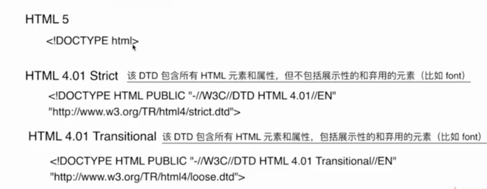

---

hideFooter: true

---
# 其他总结-- #

::: tip 契子
- 
:::

## &01.通信类 ##
- 什么是同源策略及其限制
    不是一个源的文档无法操作另一个不同源的文档：无法操作cookie、无法操作dom、ajax请求不能操作

- 前后端如何通信
    Ajax、WebSocket、CORS

- 如何创建Ajax
    XMLHttpRequest对象的工作流程、兼容处理、事件的触发条件、事件的触发顺序

- 跨域通信的几种方法
    JSONP--利用script异步加载，指定callback函数名，服务器返回之后，执行函数

    Hash--场景是当前页面A，被使用iframe嵌入到页面B，修改iframe.src的值；window.onhashchange

    postMessage--h5通信标准
    
    WebSocket、CORS

## &02.渲染机制 ##
- 什么是DOCTYPE及作用
    直接告诉浏览器什么是DTD，DOCTYPE是用来声明文档类型和DTD规范，一个主要的用途就是文件的合法性验证，如果文件代码不合法，那么浏览器解析时便会出错。

    常见的DOCTYPE有哪些？
    
    HTML4.01有严格模式和宽松模式；

- 浏览器渲染过程
    1. 浏览器解析元素，通过html parser将元素解析为DOM Tree；
    2. 浏览器解析css，通过css parser将css解析为style Rules；
    3. Dom Tree和style Rules结合，生成Render Tree(这里只是包含结构和样式，并不包括内容和元素位置等具体信息)；
    4. Render Tree与Layout结合，教给浏览器paint

- 重排reflow
    reflow概念；什么情况触发reflow；什么情况避免触发reflow--尽量避免修改到dom元素位置结构等；
- 重绘Repaint
    定义；触发条件；如何最小程度的repaint--尽量创建fragment片段，一次性添加到页面中
- 布局Layout

## &03.js渲染机制 ##
- 如何理解js单线程
    一定时间只能执行一项任务，不能执行多项任务

    原因：作为浏览器脚本语言，JavaScript的主要用途是与用户互动，以及操作DOM，这决定了它只能是单线程，
- js任务队列
    为了要执行的代码，就有一个JavaScript的任务队列

    同步任务和异步任务

    异步任务：setTimeout和setInterval 、监听DOM、promise
- Event Loop
    js主线程会不停的从执行栈(同步队列)中读取事件，执行完毕之后，会去查看任务队列是否有任务。

    宏任务队列：setTimeout、setInterval、XHLHttpRequest

    微任务队列：promise

    微任务队列优先级高于宏任务队列

    ```bash
      setTimeout(() => {
        console.log(1);
    }, 0);

    new Promise((resolve) => {
        console.log(2);
        resolve();
    }).then(() => {
        console.log(3);
    });

    console.log(4);   //2、4、3、1
    ```
    ```bash
        let a = () => {
        setTimeout(() => {
            console.log('任务队列函数1')
        }, 0)
        for (let i = 0; i < 5000; i++) {
            console.log('a的for循环')
        }
        console.log('a事件执行完')
        }

        let b = () => {
        setTimeout(() => {
            console.log('任务队列函数2')
        }, 0)
        for (let i = 0; i < 5000; i++) {
            console.log('b的for循环')
        }
        console.log('b事件执行完')
        }

        let c = () => {
        setTimeout(() => {
            console.log('任务队列函数3')
        }, 0)
        for (let i = 0; i < 5000; i++) {
            console.log('c的for循环')
        }
        console.log('c事件执行完')
        }

        a();
        b();
        c();
        // 输出最后的结果
        答案：
        (5000)a的for循环
        a事件执行完
        (5000)b的for循环
        b事件执行完
        (5000)c的for循环
        c事件执行完
        任务队列函数1
        任务队列函数2
        任务队列函数3
        //结果是当a、b、c函数都执行完成之后，三个setTimeout才会依次执行
    ```


    哪些语句放入异步队列

    理解语句进入异步队列的时机

## &04.强缓存与弱缓存 ##

缓存可以简单的分为两种类型：强缓存(200 from cache)和协商缓存(304)

区别简述如下：

    * 强缓存（200 from cache）时，浏览器如果判断本地缓存未过期，就直接使用，无需发起http请求（expired与cache-control）
    * 协商缓存（304）时，浏览器会向服务端发起http请求（带上上一次服务器给你的标记），拿着标记与现在资源的标记进行对比，然后服务端告诉浏览器文件未改变，让浏览器使用本地缓存

对于协商缓存，使用强制刷新就可以让缓存无效；但是对于强缓存，在未过期时，必须更新资源路径才能发起新的请求。

完整的协商缓存过程：发请求-->看资源是否过期-->过期-->请求服务器-->服务器对比资源是否真的过期-->没过期-->返回304状态码-->客户端用缓存的老资源。

## &05.页面性能 ##

https://www.cnblogs.com/smjack/archive/2009/02/24/1396895.html

- 题目：提升页面性能的方法有哪些

    1、压缩资源合并，减少HTTP请求

    2、非核心代码的异步加载--异步加载的方式--异步加载的区别

    异步加载的方式：1）动态脚本加载；2）script标签添加defer；3）script标签添加async

    异步加载的区别

        1）defer是在HTML加载完成之后才会执行，如果是多个，按照加载的顺序依次执行；

        2）async是在加载完之后立即执行，如果是多个，执行顺序和加载顺序无关；

    3、使用浏览器缓存--缓存的分类--缓存的原理

    缓存的分类--强缓存和协商缓存

    强缓存：expires、cache-control，如果两个都设置，以cache-control为准

    协商缓存：Last-Modified、If-Modified-If-Modified-Since、Etag、If-None-Match

    4、预解析DNS--dns-pre-fetch，大部分浏览器的a标签，默认打开预解析；但是如果连接是https，很多浏览器关闭了预解析

    5、使用CDN：如果一个网站用了n个js、n个css，n个图片，把资源放在cdn上，可以更快的把资源解析出来

## &06.错误监控类 ##
- 前端错误的分类：即时运行错误(代码错误)、资源加载错误

## &07.web 安全 ##
https://github.com/LuckyWinty/fe-weekly-questions/issues/1

## &09.浏览器渲染相关 ##
1.JavaScript会阻塞dom的解析

当解析的过程遇到script标签，会停止当前解析转而去加载script标签当中的脚本；当处理完脚本之后，浏览器便继续解析HTML文档

2.关于jquery中的ready函数

jquery中的ready函数实际上是监听DOMContentLoaded事件，在页面执行完成之后执行，此时页面上的图片、音频资源等可能没有加载完成。这样做的好处是，可以访问到页面上的所有元素，缩短页面的交互时间，提高页面的整体体验

3.把css放头部，把js放在尾部的原因

浏览器中的渲染引擎会尝试尽快在屏幕上显示内容，所以不会等到所有的html元素加载完成才去构建和布局dom树，所以部分内容将被解析并显示。

也就是说，css放在头部，在加载生成dom树的时候，就可以同时对DOM tree进行渲染。这样可以防止闪跳、白屏或者布局混乱

js放在尾部是因为，js可能会改变DOM tree的结构，所以需要一个稳定的DOM tree

## &10.常见的浏览器兼容性问题 ##
1. 不同浏览器的标签默认的外补丁和内补丁不同
场景：用各个浏览器写，不加样式的情况下，margin和padding的差距比较大

解决：全局添加 *{margin: 0;padding: 0};

2. 使用meta浏览器来调节浏览器的渲染方式，告诉浏览器以哪种内核渲染，360浏览器就是在ie和chrome之间来回切换。
<meta http-equiv="X-UA-Compatible" content="IE=edge,chrome=1">

3. css3 前缀：用来兼容这些浏览器老版本
-moz-代表firefox浏览器私有属性/-ms-代表ie浏览器私有属性/-webkit-代表safari、chrome私有属性/-o-代表Opera

4. css3 很多属性不兼容IE8:rgba（用opacity解决）、过渡（用JS动画解决）、background-size

5. 快级属性标签float之后，加上同行有元素设置margin，在IE6显示的margin比设置的大

常见：IE6中后面的一块被顶到下一行

解决：在float的标签样式控制中加入 display:inline;将其转化为行内属性

6. 事件监听的兼容
场景：IE不支持addEventListener    解决：给IE添加attachEvent

场景：IE6789不支持event.arget     解决：event.srcElement

场景：IE6789不支持e.preventDefault  解决：event.returnValue = false

场景：IE6789不支持e.stopPropagation  解决：event.cancelBubble = false

## &11.cookie和session的区别 ##
1. 存储位置不同

cookie是存放在客户端的，session是存放在服务器

2. 存储容量

单个cookie保存的数据《=4kb，一个站点最多保存20个cookie；对于session来说并没有上限，但出于对服务器端性能考虑，session内不要存放过多的东西，并且设置session删除机制

3. 存储方式不对

cookie只能保管ASCII字符串，并需要通过编码方式存储为Unicode字符或者二进制；session能够存储任何类型的数据

4. 隐私策略不同

cookie对客户端是可见的，所以不安全；session存储在服务器，对客户端是透明的，不存在敏感泄漏的风险

5. 跨域支持不同

cookie支持跨域访问；session不支持跨域访问