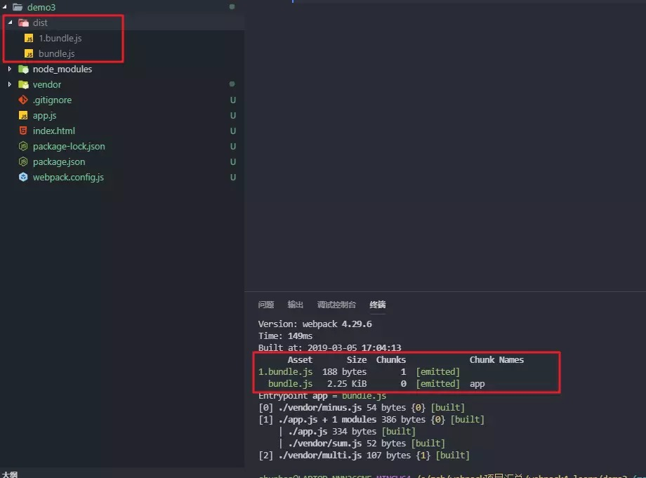

---

hideFooter: true

---
# webpack-- #

::: tip 契子
- webpack
- https://juejin.im/post/5cae0f616fb9a068a93f0613#heading-3
- devDependencies用于本地环境开发，开发环境会使用；dependencies，生产环境和开发环境都会使用
:::

## &01.output/entry基础 ##
JavaScript的模块打包工具，通过分析模块之间的依赖，最终将所有的模块打包成一份或者多份代码包，供HTML直接使用。

- webpack4 引入了production（生产）和development（开发）模式

- webpack打包AMD文件
webpack在打包AMD文件时，会单独打出一个bundle.js包出来，这和AMD的写法有关系；在实际写代码中，最好使用ES6和CommonJS规范来写


- webpack再编译时，先删除dist文件，再生成新的文件：clean-webpack-plugin

## &02.用Babel7转译ES6 ##
并非每一个浏览器都知道如何处理ES6。

webpack需要使用babel-loader转译


## &03.Code Splitting ##
webpack打包，默认会把业务代码和三方框架代码一起打包，每次请求时文件会很大。尤其是业务代码改动频繁，每次上线后都会重新请求资源。第一次加载之后，浏览器第二次请求时，如果文件大小没有变化，会默认取缓存里面的文件。

这里把业务代码和三方框架代码分割开，这样页面刷新或者第二次进入的时候，可以加快网页加载速度

- webpack4 引入splitChunksPlugins，是webpack主模块中的一个细小模块，无需npm引入
- 业务代码和三方资源代码或者公共文件分开，使其和业务代码分开缓存，极大的提高效率
- 可用做提取公共代码

* splitChunksPlugins详细配置
1、chunks默认async，只会分割异步代码。如果写的是import资源，再加业务代码，会被看作是同步代码

```bash
optimization: {
  splitChunks: {
    chunks: 'async',   //webpack默认配置；all代表分割同步和异步代码
    minSize: 30000,
    maxSize: 0,
    minChunks: 1,
    maxAsyncRequests: 5,
    maxInitialRequests: 3,
    automaticNameDelimiter: '~',
    name: true,
    cacheGroups: {
      vendors: {
        test: /[\\/]node_modules[\\/]/,
        priority: -10    //优先级
      },
      default: {
        minChunks: 2,
        priority: -20,
        reuseExistingChunk: true
      }
    }
  }
}

```

解析流程：比如要分割vue或者Jquery其他三方框架，如果满足前面minSize等条件配置，进入cacheGroups=》根据cacheGroups中的配置，决定vue或者Jquery是否打包成一个文件或者分开打包=》vendors配置node_modules中的三方框架代码

如果想要分开打某个资源包--注意priority的优先级

```bash
cacheGroups: {
  //单独分离某三方框架包
  lodash: {
    name: 'lodash',
    test: /[\\/]node_modules[\\/]lodash[\\/]/,
    priority: 10  // 优先级要大于 vendors 不然会被打包进 vendors
  },
  //提取公共代码
  commons: {
    name: 'commons',
    minSize: 0, //表示在压缩前的最小模块大小,默认值是 30kb
    minChunks: 2, // 最小公用次数
    priority: 5, // 优先级
    reuseExistingChunk: true // 公共模块必开启
  },
  vendors: {
    name: 'vendors',   //在默认设置中，会将node_mudules中的模块打入到dist/vendors中
  }
},

```
打包之后对比：


## &04.lazy loading 和prefetch ##
- 按需加载
- webpack只是能够识别import语法，能进行代码分割；注意一些低版本浏览器可能不支持promise，就要使用 babel 以及 babel-polyfill 来做转换
- 注意代码使用率
```bash
//模拟按需加载
document.getElementById('btn').addEventListener('click', function() {
    console.log('click');
    //为动态生成的 Chunk 赋予一个名称，以方便我们追踪和调试代码。 如果不指定动态生成的 Chunk 的名称，默认名称将会是  [id].js
    //use-lodash为动态生成的业务代码
    import(/* webpackChunkName: 'use-lodash'*/ 'lodash').then(function(_) {
        console.log(_.join(['1', '2']))
    })
})
```
页面呈现：点击按钮之后，才会加载loadsh三方库和use-lodash业务文件

- 另一种情况：如果首页所需资源加载完成，但是业务代码没有加载，用户点击之后可能会出现等待很久的情况--webpackPrefetch/webpackPreload

webpackPrefetch：会等待核心代码加载完之后，有空闲之后再去加载

webpackPreload：会和核心的代码并行加载，还是不推荐

## &05.自动生成html文件 ##