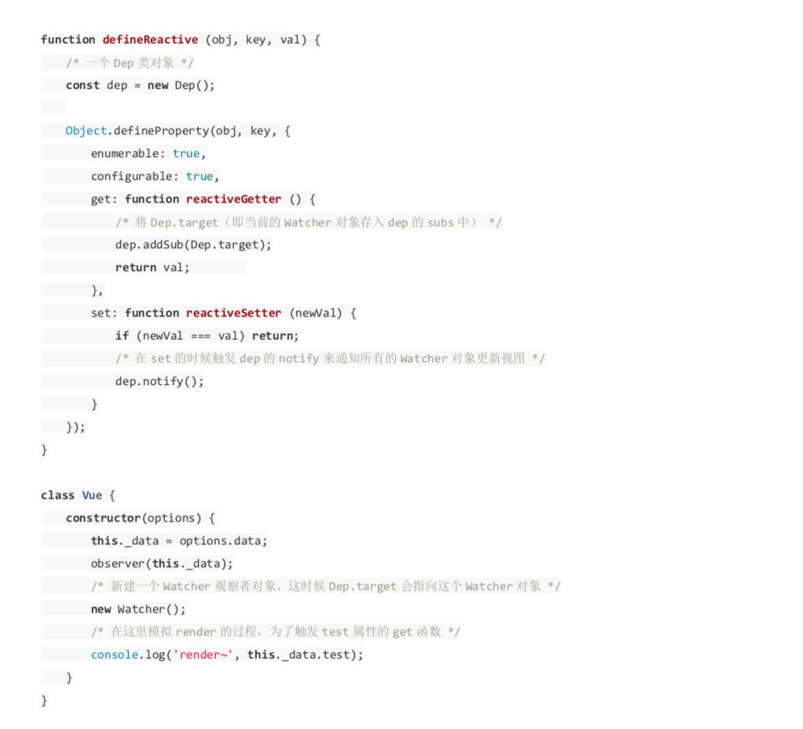
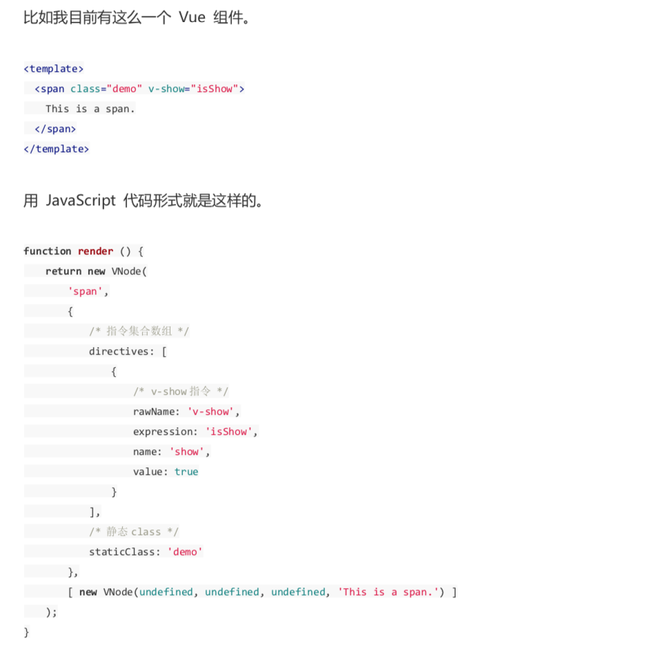

# A001_VUE源码解析（二）--小节 #

## Object.defineProperty ##

定义data数据--可观测

## 响应式追踪原理的依赖收集追踪原理 ##

依赖收集：刚开始，我们都知道data用Object.defineProperty来定义。当一个获取一个数据的时候，会触发reactiveGetter把当前的watcher对象加入队列当中，收集到Dep类当中去。如果该数据被改写，会触发reactiveGetter方法，通过Dep类中的通知函数，触发所有watcher对象的update函数。

总结：get进行依赖收集，set通过观察者来更新视图

## 实现Virtual Dom下的一个VNode节点 ##

vue中，render function会将节点转为VNode节点。virtual dom实际上就是一颗以JavaScript对象为基础的一颗dom树，用对象属性来描述节点，实际上只是一层对dom层的抽象，然后通过一系列的操作映射到真实环境上，因为virtual dom是以JavaScript作为依赖，因此具有垮平台性。

## template模版是如何通过Compile编译的 ##

## template模版是如何通过Compile编译的 ##

diff算法：通过同层的树节点进行比较而非对树进行逐层搜索遍历的方式，所以时间负责度只有O(n)，得到差异之后，会将这些差异更新到视图上

