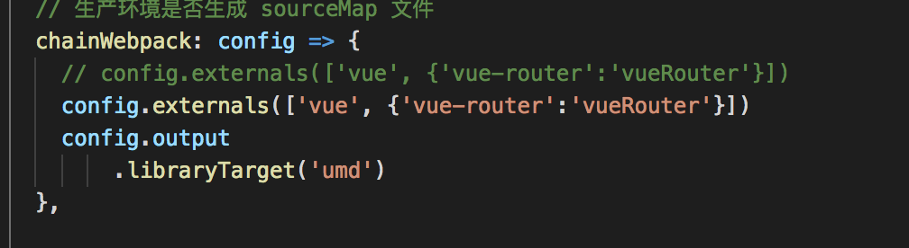

---

hideFooter: true

---
# Single-SPA #

::: tip 契子
- 微前端服务：将 Web 应用由单一的单体应用转变为多个小型前端应用聚合为一的应用。各个前端应用还可以独立运行、独立开发、独立部署。
- 监听路由变化，匹配url对应的路由，加载相应资源
- 主项目只有一个html入口，子项目通过主项目来按需加载，子系统间切换不再刷新
- 主项目加载子项目中需要公共加载的包，子项目只有自己的业务代码，打包出来的dist很少
:::

## &01.设计理念 ##

1.中心化路由

在前端应用中路由是中心，因为有了路由才能展示相应的界面。在基于single-spa的微前端项目中我们需要一个地方去管理我们的应用，即：发现存在哪些应用，这些应用都对应了哪个路由，在特定的路由先去加载这个应用对应的资源

2.标识化应用

给每个应用都起一个唯一的名字。

3.独立配置与配置自动化

## &02.前端入口项目 ##

前端入口项目不写业务代码，只写业务系统相关的配置，注册各个业务项目以及加载各个业务项目的资源，入口项目只有一个html文件，在业务项目处于激活状态时，将业务项目的dom树挂载到入口项目的html中


## &03.业务项目 ##

按需加载。对应相应js资源

- systemJs：通用模块加载器

CommonJS：同步加载模块器（module.exports）;

AMD: 异步加载模块，为浏览器环境设计，RequireJS即为遵循AMD规范的模块化工具，requireJS的基本思想是，通过define方法定义模块化，通过require加载模块。

- 子项目配置umd格式输出

https://segmentfault.com/a/1190000019920162



- 路由匹配

从url hash值后开始进行子项目的路由匹配

- 优化打包配置

将公用依赖包放入主项目引入，提高打包效率

```bash
chainWebpack: config => {
    config.externals(['vue', {'vue-router':'vueRouter'}])
    config.output
        .libraryTarget('umd')
  },
```
